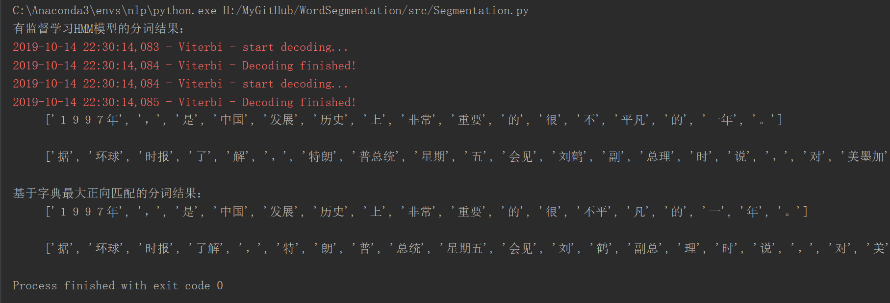
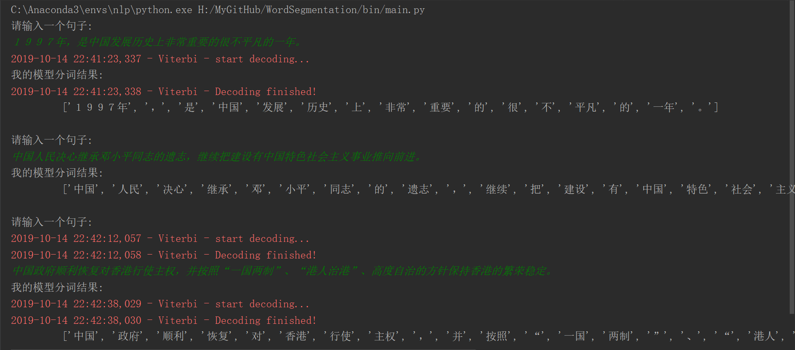

# 分词算法

基于1998年人民日报标注数据进行训练

## 一、基于词典的最大正向匹配算法

`./src/dict_match.py`

## 二、隐马尔可夫模型分词

`./src/HMM.py`，标注体系为 BMES，即B表示词的第一个字，M表示词的中间字，E表示词的最后一个字，S表示单个字的词

### 1. 有监督学习的分词：观测数据(观测状态) 和 标注数据(隐含状态)

`./util/supervised_learning_segmentation.py` 用于从标注语料中学习 初始概率矩阵、状态转移概率矩阵和观测概率矩阵

### 2. 无监督学习的分词：只有观测数据(观测状态)

`./util/unsupervised_learning_segmentation.py` 用于从观测数据中，基于baum-welch算法学习初始概率矩阵、状态转移概率矩阵和观测概率矩阵：

1. 我们通过先验知识可以确定有几种隐状态，比如分词中，基于BMES标注体系，就有四种隐状态
2. 在模型中，无论是观测状态，还是隐状态，我们都是通过顺序数字进行编码，输出时，再进行转换即可
3. 基于Baum-Welch算法学习三个矩阵，数字编码的隐状态具体对应的实际隐状态是未知的，需要我们通过预测结果来进行确定，即 确定具体是哪种隐状态对应哪种数字隐状态，这个可以通过./util/discriminate_latent_state.py来确定
4. 事实上，笔者对1998年人民日报标注数据进行无监督学习，但是会出现除零异常，如果加上一个小值仍会出现，但是分子分母都加上1，却不会，但是会改变原有概率分布，并且概率和并不为1，此处暂时未考虑好如何妥善处理，笔者猜测，可能是数据不足，因为字符有4714种，即观测状态有4714种，但数据只有19484条，数据量少的缘故，导致许多参数为0,出现除零异常；

## 三、模块介绍

### 1. source_data

存储1998年人民日报标注数据 和 其数据格式说明

### 2. data

存储从source_data中抽取出来的数据，通过`./util/extract_from_source_data.py`进行抽取，每个文件的说明，在该模块中有说明

### 3. matrix

存储通过有监督学习和无监督学习得到的参数矩阵，具体是通过`./util/supervised_learning_segmentation.py` 和 `./util/unsupervised_learning_segmentation.py`实现的，有监督学习得到的参数数据都是以"S"开头，无监督学习得到的参数数据都是以"U"开头。

### 4. util

存储工具模块

### 5. src

存储分词模块：

`dict_match.py` 实现基于字典的最大正向匹配算法

`HMM.py` 实现基于HMM的分词算法

`Segmentation.py` 实现了一个分词器：最大正向匹配、有监督HMM，无监督HMM，执行该程序结果如下：

### 6. bin

直接执行`main.py`后，便可以输入一个句子，返回一个分词结果

## 四、分词结果

运行`./bin/main.py`

